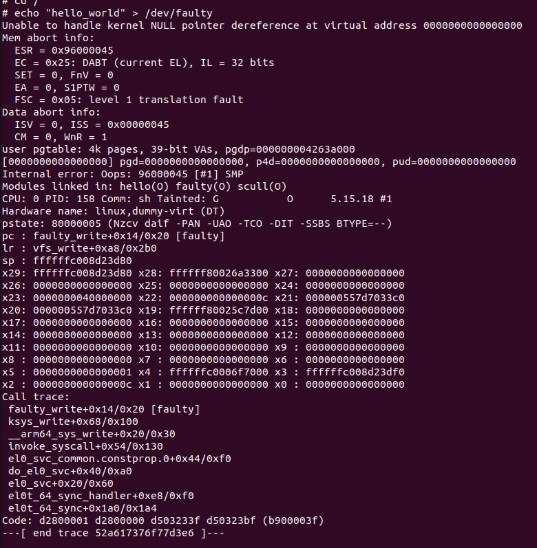
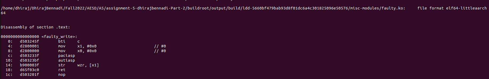

## Faulty Write

The error message clearly identifies this as a case of NULL pointer dereferencing which is an **expection**

An attempt is being made to write to faulty_write function at an offset of 0x14 from the base address which is a cause of error.

## Objdump

On analyzing the objdump, the assembly instructions indicate a zero address is being dereferenced

